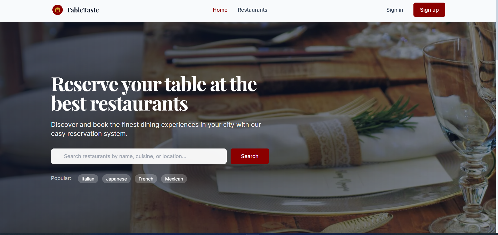
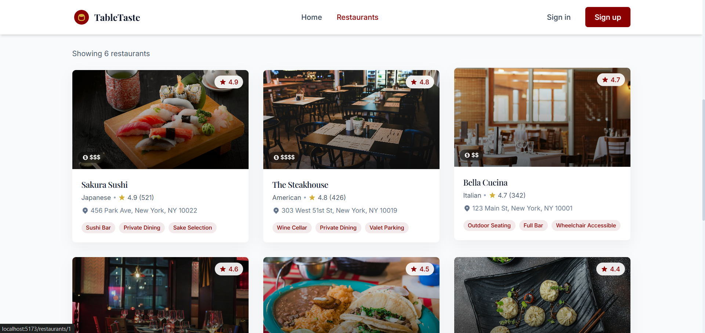
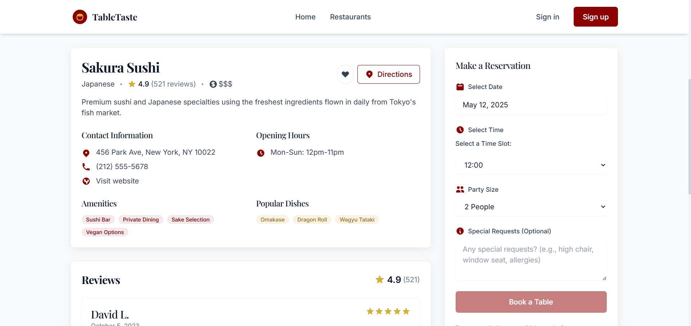
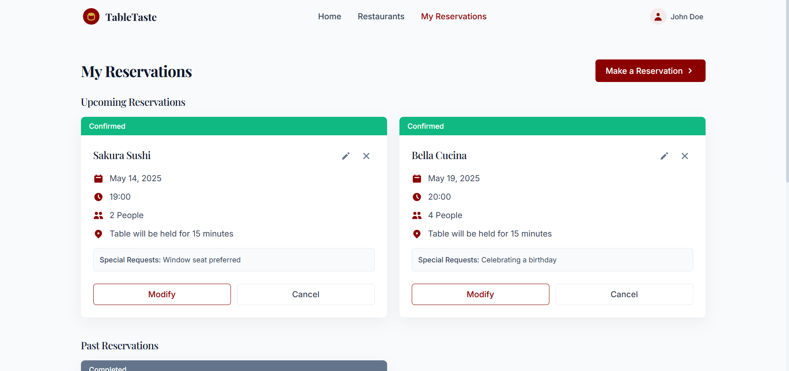

# TableTaste

TableTaste is a restaurant reservation platform that allows users to discover, explore, and book tables at the best restaurants in their city. With a user-friendly interface, instant booking confirmations, and advanced filtering options, TableTaste makes dining out a seamless experience.

## Tech Stack Used

### Frontend
- **Framework**: React (with Vite for fast development)
- **Styling**: Tailwind CSS
- **Animations**: Framer Motion
- **Icons**: React Icons

### Backend
- **Mock Data**: Simulated backend using in-memory data (for demonstration purposes)

### Database
- **Mock Database**: Data is stored in JavaScript objects for simplicity.

### Hosting
- **Local Development**: Vite Dev Server (for local testing and development)
- **Hosted**: [Netlify Url](https://tabletaste.netlify.app/)

## Screenshots & Previews

### Home Page


### Restaurant List


### Restaurant Detail


### Restaurant Detail


## Setup Instructions

Follow these steps to set up and run the application locally:

1. **Clone the Repository**:
   ```bash
   git clone https://github.com/HarshSharmaIN/UI-Arena---Team-Griffin.git
   cd frontend
   ```
2. **Install Packages**:
   ```bash
   npm install
   ```
3. **Start Local Development**
   ```bash
   npm run dev
   ```
